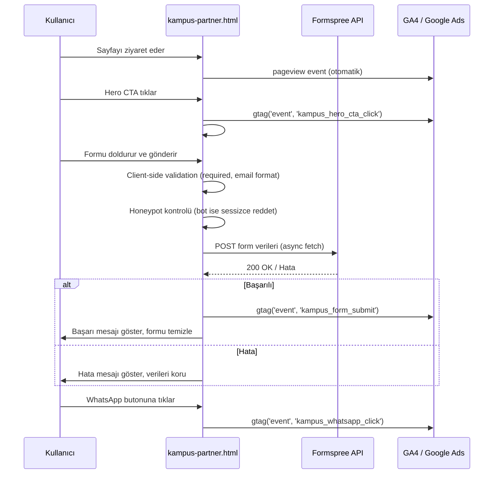
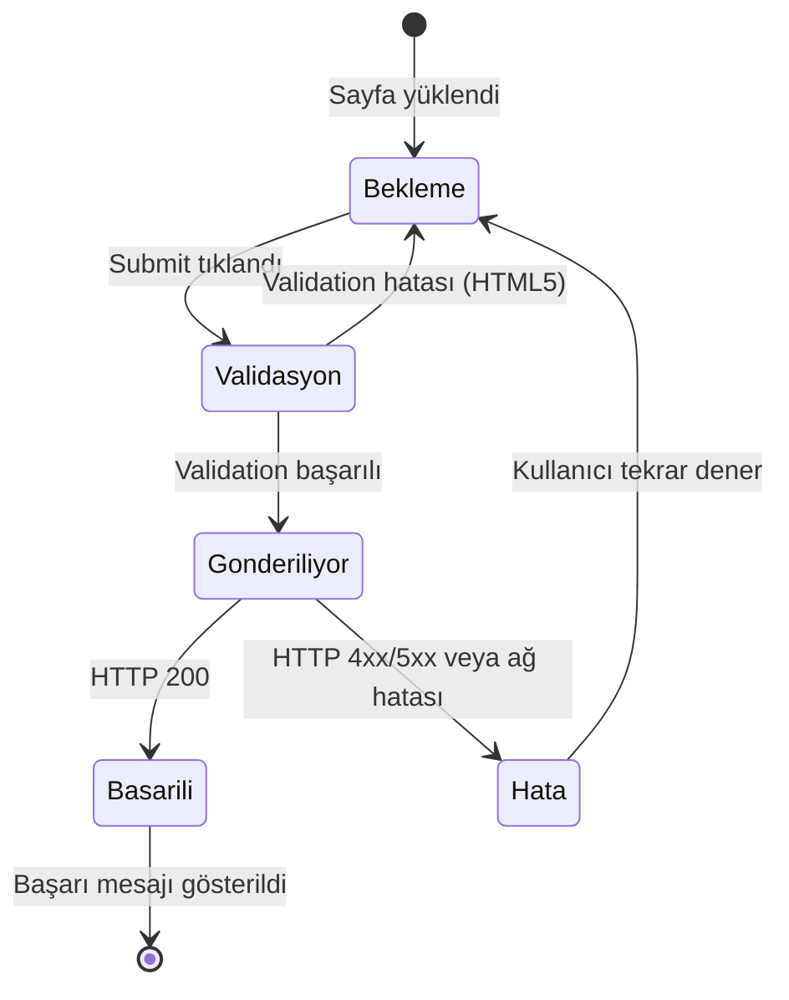

# Teknik Tasarım Dokümanı — Gelka Kampüs Partner

## Genel Bakış

### Amaç ve Kapsam

Bu doküman, `kampus-partner.html` landing page'inin teknik tasarımını tanımlar. Sayfa, mevcut gelkaenerji.com.tr statik sitesine entegre edilecek, tek dosyalık bir HTML sayfasıdır. Mevcut `styles.css` dosyasına eklenen CSS kuralları ve `script.js` ile uyumlu inline JavaScript ile çalışacaktır.

Sayfa, üniversite öğrencilerinin ticari işletmelerin elektrik faturalarını Gelka Enerji'ye ileterek aylık burs kazanmalarını sağlayan Kampüs Partner programını tanıtır ve başvuru toplar.

Kapsam dahilinde olan öğeler:
- Tek sayfalık statik HTML landing page (`kampus-partner.html`)
- Mevcut `styles.css` dosyasına eklenecek CSS kuralları
- Inline JavaScript davranışları (form gönderimi, accordion, sticky CTA, smooth scroll)
- Formspree entegrasyonu (form gönderimi)
- GA4 + Google Ads analitik entegrasyonu
- SEO meta etiketleri ve yapılandırılmış veri
- Responsive tasarım (320px–1920px)
- Temel erişilebilirlik uyumu

Kapsam dışında olan öğeler:
- Backend/sunucu tarafı geliştirme
- CMS entegrasyonu
- Kullanıcı kimlik doğrulama
- Ödeme/burs dağıtım sistemi
- A/B test altyapısı (Faz 2'de değerlendirilecek)

### Temel Tasarım Kararları

| Karar | Seçim | Gerekçe |
|-------|-------|---------|
| Sayfa mimarisi | Tek statik HTML dosyası | Mevcut site yapısıyla uyum; build tool yok |
| CSS stratejisi | `styles.css`'e yeni kurallar ekleme | Mevcut CSS değişkenleri ve bileşen stilleri yeniden kullanılır |
| JavaScript | Inline `<script>` + `script.js` referansı | Mevcut accordion, mobile menu, cookie, WhatsApp JS'i script.js'den gelir |
| Form gönderimi | Formspree (`https://formspree.io/f/xwvneaod`) | Mevcut sitedeki tüm formlarla aynı endpoint; sunucu tarafı kod gerektirmez |
| Analitik | gtag.js (GA4 + Google Ads) | Mevcut sitedeki tracking yapısının aynısı |
| Hero stili | Gradient arka plan (bayilik.html paterni) | Arka plan görseli gerektirmez, hızlı yüklenir |
| Accordion | Semantic `<button>` + `aria-expanded` | Erişilebilirlik uyumlu, mevcut FAQ paterni temel alınır |
| Spam koruması | Honeypot alanı (CSS ile gizli) | Basit bot koruması; CAPTCHA gerektirmez |
| Responsive yaklaşım | Mobile-first, breakpoint'ler: 768px, 1024px | Mevcut site ile tutarlı |

## Mimari

### Yüksek Seviyeli Mimari

Sayfa tamamen statik bir yapıdadır. Sunucu tarafı işlem yoktur. Tüm etkileşimler istemci tarafında gerçekleşir:

```
┌─────────────────────────────────────────────────────┐
│                    Tarayıcı                          │
│  ┌───────────────────────────────────────────────┐  │
│  │  kampus-partner.html (Statik HTML)            │  │
│  │  ├── styles.css (Paylaşılan CSS)              │  │
│  │  ├── script.js (Paylaşılan JS — menu, cookie) │  │
│  │  └── Inline <script> (Form, Accordion, CTA)   │  │
│  └───────────────────────────────────────────────┘  │
│           │              │              │            │
│           ▼              ▼              ▼            │
│    ┌──────────┐  ┌──────────────┐  ┌──────────┐    │
│    │ Formspree│  │ GA4/Google   │  │ WhatsApp │    │
│    │ API      │  │ Ads (gtag)   │  │ API      │    │
│    └──────────┘  └──────────────┘  └──────────┘    │
└─────────────────────────────────────────────────────┘
```

Teknoloji yığını:
- **HTML5**: Semantik etiketler, ARIA attribute'ları
- **CSS3**: CSS değişkenleri, Grid, Flexbox, media queries
- **Vanilla JavaScript**: ES6+, async/await, IntersectionObserver, FormData API
- **Formspree**: Form verilerini e-posta olarak ileten üçüncü parti servis
- **gtag.js**: Google Analytics 4 ve Google Ads izleme

### Dosya ve Kaynak Yapısı

```
gelkaenerji.com.tr/
├── kampus-partner.html          ← Yeni sayfa (tek dosya)
├── styles.css                   ← Mevcut — yeni CSS kuralları eklenir
├── script.js                    ← Mevcut — değişiklik yok
├── kvkk.html                    ← Mevcut — KVKK bağlantısı hedefi
├── sitemap.xml                  ← Güncellenir (yeni URL eklenir)
├── yatay_logo.png               ← Mevcut — OG image
├── index.html                   ← Mevcut — header/footer kaynak
└── bayilik.html                 ← Mevcut — hero/form paterni kaynak
```

### Sayfa Yapısı (DOM Hiyerarşisi)

```
kampus-partner.html
├── <head>
│   ├── Meta etiketleri (SEO, OG, canonical, robots)
│   ├── GA4 + Google Ads gtag.js
│   ├── styles.css referansı
│   ├── Google Fonts (Poppins)
│   ├── Font Awesome 6.4.0
│   └── Schema.org JSON-LD (WebPage)
├── <body>
│   ├── .top-banner (kopyala — index.html)
│   ├── .header (kopyala — index.html)
│   ├── #hero — .kampus-hero
│   ├── #guven — .trust-band
│   ├── #program-nedir — Program Tanıtımı
│   ├── #nasil-calisir — Nasıl Çalışır (4 adım timeline)
│   ├── #nereden-baslayabilirim — Nereden Başlayabilirim (7 başlangıç noktası grid)
│   ├── #hangi-isletmelere — Hangi İşletmelere Gidebilirim (9 işletme türü grid)
│   ├── #burs-modeli — Burs Tablosu
│   ├── #coklu-isletme — Birden Fazla İşletme
│   ├── #kariyer — Kariyer & Sektör Deneyimi (3 kart + banner)
│   ├── #kimler-katilabilir — Katılım Koşulları
│   ├── #sss — SSS Accordion (5 soru)
│   ├── #kampus-lideri — Kampüs Lideri
│   ├── #basvuru-formu — Başvuru Formu
│   ├── .footer (kopyala — index.html)
│   ├── .cookie-banner (kopyala — index.html)
│   ├── .whatsapp-float (özel mesaj metni)
│   ├── #stickyCta — Mobil Sticky CTA
│   └── <script> blokları
```

### Bilgi Mimarisi ve Bölüm Sırası

Bölüm sıralaması AIDA (Attention → Interest → Desire → Action) modeline dayanır:

| Sıra | Bölüm | AIDA Aşaması | Amacı |
|------|-------|--------------|-------|
| 1 | Hero | Attention | İlk izlenim, değer önerisi |
| 2 | Güven Şeridi | Attention | Kurumsal güvence |
| 3 | Program Nedir? | Interest | Modelin açıklanması |
| 4 | Nasıl Çalışır? | Interest | Sürecin netleştirilmesi |
| 5 | Nereden Başlayabilirim? | Interest | Psikolojik bariyerin kırılması |
| 6 | Hangi İşletmelere? | Interest | Hedef işletme türlerinin somutlaştırılması |
| 7 | Burs Modeli | Desire | Somut kazanç örnekleri |
| 7 | Çoklu İşletme | Desire | Potansiyelin artırılması |
| 8 | Kariyer & Sektör | Desire | Burs ötesi değer |
| 9 | Kimler Katılabilir? | Desire | Hedef kitle eşleşmesi |
| 10 | SSS | Desire | Tereddütlerin giderilmesi |
| 11 | Kampüs Lideri | Desire | Ek motivasyon |
| 12 | Başvuru Formu | Action | Dönüşüm noktası |

### Veri Akışı




## Bileşenler ve Arayüzler

### 1. Head Bölümü

Mevcut index.html `<head>` yapısı temel alınır. SEO, OG, analitik ve kaynak referansları:

```html
<head>
    <meta charset="UTF-8">
    <meta name="viewport" content="width=device-width, initial-scale=1.0">
    <title>Kampüs Partner - Öğrenci Burs Programı | Gelka Enerji</title>
    <meta name="description" content="Gelka Kampüs Partner Programı ile üniversite öğrencileri çevrelerindeki işletmelerin elektrik faturalarını ileterek aylık burs kazanabilir. Kampüs partner başvurusu yapın.">
    <meta name="robots" content="index, follow">
    <link rel="canonical" href="https://www.gelkaenerji.com.tr/kampus-partner.html">
    <!-- OG etiketleri -->
    <meta property="og:type" content="website">
    <meta property="og:url" content="https://www.gelkaenerji.com.tr/kampus-partner.html">
    <meta property="og:title" content="Kampüs Partner - Öğrenci Burs Programı | Gelka Enerji">
    <meta property="og:description" content="Üniversite öğrencilerine yönelik enerji bursu programı. İşletmelerin elektrik faturalarını Gelka Enerji'ye ileterek aylık burs kazanın.">
    <meta property="og:image" content="https://www.gelkaenerji.com.tr/yatay_logo.png">
    <!-- GA4 + Google Ads -->
    <script async src="https://www.googletagmanager.com/gtag/js?id=G-442PEKLLWZ"></script>
    <script>
        window.dataLayer = window.dataLayer || [];
        function gtag(){dataLayer.push(arguments);}
        gtag('js', new Date());
        gtag('config', 'G-442PEKLLWZ');
        gtag('config', 'AW-2838120596');
    </script>
    <link rel="stylesheet" href="styles.css">
    <link href="https://fonts.googleapis.com/css2?family=Poppins:wght@300;400;500;600;700&display=swap" rel="stylesheet">
    <link rel="stylesheet" href="https://cdnjs.cloudflare.com/ajax/libs/font-awesome/6.4.0/css/all.min.css">
</head>
```

SEO başlık yapısı:
- `<title>`: 50–60 karakter, birincil anahtar kelime önde
- `<meta description>`: 140–160 karakter, doğal Türkçe, CTA niteliğinde
- `<link rel="canonical">`: Tam URL, trailing slash yok
- Yapılandırılmış başlıklar: Tek `<h1>`, bölüm başlıkları `<h2>`, alt başlıklar `<h3>`

### 2. Site Header & Footer (Kopyala-Yapıştır)

index.html'deki `.top-banner`, `.header` ve `.footer` blokları birebir kopyalanır. Navigasyonda aktif sayfa vurgusu yapılmaz (bayilik.html'deki `class="active"` gibi bir işaretleme eklenmez; launch sonrası menüye eklenme kararı ayrıca değerlendirilir — Gereksinim 1.7).

### 3. Hero Bölümü (`.kampus-hero`)

bayilik.html'deki `.bayilik-hero` paterni temel alınır (gradient arka plan, arka plan görseli yok):

```html
<section id="hero" class="kampus-hero">
    <div class="container">
        <h1>Elektrik Faturası Getir, Aylık Burs Kazan</h1>
        <p class="hero-subtitle">Gelka Kampüs Partner Programı ile üniversite öğrencileri 
        çevrelerindeki işletmelerin elektrik faturalarını Gelka Enerji'ye ileterek 
        aylık burs kazanma fırsatı elde edebilir.</p>
        <p class="hero-desc">İşletmeler için avantajlı elektrik teklifleri hazırlanır. 
        İşletme Gelka Enerji ile sözleşme yaptığında, yönlendirmeyi yapan öğrenci 
        için burs süreci başlar.</p>
        <a href="#basvuru-formu" class="btn btn-primary btn-large" 
           onclick="gtag('event', 'kampus_hero_cta_click')">
            <i class="fas fa-graduation-cap"></i> Kampüs Partner Ol
        </a>
    </div>
</section>
```

CSS: `.kampus-hero` stili `.bayilik-hero` ile aynı yapıda — `background: var(--gradient-hero)`, beyaz metin, padding üst/alt. CTA butonu `#basvuru-formu`'na smooth scroll yapar.

### 4. Güven Şeridi (`.trust-band`)

Hero'nun hemen altında, 4 güven unsuru yatay düzende:

```html
<section id="guven" class="trust-band">
    <div class="container">
        <div class="trust-band-grid">
            <div class="trust-band-item">
                <i class="fas fa-certificate"></i>
                <span>EPDK lisanslı yapı</span>
            </div>
            <div class="trust-band-item">
                <i class="fas fa-chart-bar"></i>
                <span>İşletmelere özel teklif analizi</span>
            </div>
            <div class="trust-band-item">
                <i class="fas fa-clipboard-check"></i>
                <span>Şeffaf başvuru süreci</span>
            </div>
            <div class="trust-band-item">
                <i class="fas fa-shield-alt"></i>
                <span>KVKK uyumlu veri işleme</span>
            </div>
        </div>
    </div>
</section>
```

Responsive: Masaüstünde `grid-template-columns: repeat(4, 1fr)`, tablette `repeat(2, 1fr)`, mobilde `1fr` (tek sütun).

### 5. Program Tanıtımı

Mevcut `.section-header` paterni kullanılır:

```html
<section id="program-nedir" class="kampus-section">
    <div class="container">
        <div class="section-header">
            <h2>Program Nedir?</h2>
            <div class="section-divider"><span></span><i class="fas fa-bolt"></i><span></span></div>
        </div>
        <p class="kampus-intro-text">Üniversite öğrencilerine yönelik yenilikçi bir enerji bursu modeli.</p>
        <!-- Açıklama paragrafları -->
    </div>
</section>
```

İçerik tonu: "Kolay para" veya "zahmetsiz kazanç" ifadeleri kesinlikle kullanılmaz. Bunun yerine "hak edilmiş gelir", "kendi iletişim ağını değere dönüştürme" gibi ölçülü ifadeler tercih edilir.

### 6. Nasıl Çalışır (`.process-timeline`)

Mevcut `process-timeline` bileşeni yeniden kullanılır (index.html'deki 4 adımlı timeline):

| Adım | Başlık | İkon | Açıklama |
|------|--------|------|----------|
| 1 | İşletme Bulun | `fa-building` | Çevrenizde ticari elektrik kullanan bir işletme belirleyin |
| 2 | Faturayı İletin | `fa-file-invoice` | İşletmenin elektrik faturasını Gelka Enerji'ye iletin |
| 3 | Teklif Hazırlansın | `fa-chart-line` | Gelka Enerji işletmeye özel avantajlı teklif hazırlar |
| 4 | Burs Kazanın | `fa-graduation-cap` | İşletme sözleşme yaptığında burs süreci başlar |

### 6a. Nereden Başlayabilirim? (`.baslangic-grid`)

"Nasıl Çalışır" ile "Hangi İşletmelere" arasında konumlandırılır. Öğrencinin "ben kimi tanıyorum ki?" psikolojik bariyerini kırar — kendi iletişim ağındaki fırsatları somutlaştırır.

7 başlangıç noktası, 2 sütun ikon + metin grid kartları halinde sunulur:

| # | Başlangıç Noktası | İkon | Açıklama |
|---|-------------------|------|----------|
| 1 | Aile Çevresi | `fa-home` | Annenizin veya babanızın tanıdığı işletme sahipleri |
| 2 | Akrabalar | `fa-users` | Akrabalarınızın çalıştığı veya işlettiği işletmeler |
| 3 | Arkadaş Çevresi | `fa-user-friends` | Arkadaşlarınızın aile şirketleri |
| 4 | Sık Gittiğiniz Mekanlar | `fa-coffee` | Sık gittiğiniz restoran veya kafeler |
| 5 | Kampüs Çevresi | `fa-map-marker-alt` | Yurt veya kampüs çevresindeki işletmeler |
| 6 | Mahalle İşletmeleri | `fa-store` | Mahallenizdeki market, atölye veya dükkanlar |
| 7 | Staj ve İş Yerleri | `fa-briefcase` | Staj yaptığınız veya çalıştığınız şirketler |

CTA metni: "İşletmenin son elektrik faturasını Gelka Enerji'ye iletmeniz yeterlidir. Ekibimiz faturayı analiz ederek uygun bir teklif olup olmadığını kontrol eder."

Filtreleme kriteri: CTA'da "aylık elektrik faturası 25.000 TL ve üzeri" kısa referans olarak `<strong>` ile vurgulanır.

Vurgu metni (highlight): "Çoğu öğrenci programa kendi çevresindeki bir işletmeden aldığı ilk fatura ile başlar."

Responsive: Masaüstünde `grid-template-columns: repeat(2, 1fr)`, mobilde `1fr`.

CSS sınıfları: `.baslangic-grid`, `.baslangic-card`, `.baslangic-icon`, `.baslangic-text`, `.baslangic-cta`, `.baslangic-highlight`

### 6b. Hangi İşletmelere Gidebilirim? (`.isletme-grid`)

"Nasıl Çalışır" ile "Burs Modeli" arasında konumlandırılır. Öğrencinin hangi tür işletmelere yaklaşabileceğini somutlaştırır — dönüşüm için kritik bölüm.

9 işletme türü ikon grid kartları halinde sunulur:

| # | İşletme Türü | İkon |
|---|-------------|------|
| 1 | Fabrikalar | `fa-industry` |
| 2 | Üretim Tesisleri | `fa-cogs` |
| 3 | Atölyeler | `fa-tools` |
| 4 | Restoran ve Kafeler | `fa-utensils` |
| 5 | Oteller | `fa-hotel` |
| 6 | Marketler ve Zincir Mağazalar | `fa-shopping-cart` |
| 7 | Alışveriş Merkezleri | `fa-shopping-bag` |
| 8 | Hastaneler ve Sağlık Kuruluşları | `fa-hospital` |
| 9 | Büyük Ofisler ve İş Merkezleri | `fa-building` |

CTA metni: "İşletmenin elektrik faturasını Gelka Enerji'ye iletmeniz yeterli. Teklif hazırlama ve süreç yönetimi tamamen Gelka'ya ait."

Vurgu metni (highlight): "Çoğu öğrenci programa ilk olarak kendi çevresindeki bir işletmenin elektrik faturasını ileterek başlar."

Filtreleme kriteri: Intro paragrafında "aylık elektrik faturası 25.000 TL ve üzeri" kriteri `<strong>` ile vurgulanır.

Responsive: Masaüstünde `grid-template-columns: repeat(3, 1fr)`, tablette `repeat(2, 1fr)`, mobilde `1fr`.

CSS sınıfları: `.isletme-grid`, `.isletme-card`, `.isletme-icon`, `.isletme-cta`

### 7. Burs Modeli Tablosu

```html
<section id="burs-modeli" class="kampus-section">
    <div class="container">
        <div class="section-header">
            <h2>Burs Modeli</h2>
        </div>
        <div class="burs-table-wrapper">
            <table class="burs-table">
                <thead>
                    <tr>
                        <th>İşletmenin Aylık Elektrik Faturası</th>
                        <th>Örnek Aylık Burs Tutarı</th>
                    </tr>
                </thead>
                <tbody>
                    <tr><td>500.000 TL</td><td>5.000 TL'ye kadar</td></tr>
                    <tr><td>1.000.000 TL</td><td>10.000 TL'ye kadar</td></tr>
                    <tr><td>3.000.000 TL</td><td>30.000 TL'ye kadar</td></tr>
                </tbody>
            </table>
        </div>
        <p class="burs-disclaimer">Burs tutarları örnek niteliğindedir. İşletmenin tüketim profili, 
        teklif yapısı ve sözleşme süresine göre değişiklik gösterebilir.</p>
    </div>
</section>
```

Mobil: `.burs-table-wrapper` üzerinde `overflow-x: auto` ile yatay kaydırma.

### 8. Birden Fazla İşletme Yönlendirme

Basit bir vurgu bölümü — mevcut `.model-highlight` (bayilik.html) paterni kullanılır:

```html
<section id="coklu-isletme" class="kampus-section kampus-highlight-section">
    <div class="container">
        <h2>Birden Fazla İşletme Yönlendirme</h2>
        <p>Yönlendirdiğiniz işletme sayısı arttıkça burs potansiyeliniz de artar.</p>
    </div>
</section>
```

### 9. Kariyer & Sektör Deneyimi (`.kariyer-section`)

3 kart + highlight banner yapısı. Mevcut `.service-card` veya `.backbone-card` paterni temel alınır:

```html
<section id="kariyer" class="kampus-section">
    <div class="container">
        <div class="section-header">
            <h2>Sadece Burs Değil, Sektör Deneyimi</h2>
        </div>
        <div class="kariyer-grid">
            <div class="kariyer-card">
                <div class="kariyer-icon"><i class="fas fa-network-wired"></i></div>
                <h3>İletişim Ağını Değere Dönüştür</h3>
                <p>Çevrenizdeki işletme bağlantılarınızı somut bir fırsata çevirin.</p>
            </div>
            <div class="kariyer-card">
                <div class="kariyer-icon"><i class="fas fa-bolt"></i></div>
                <h3>Enerji Sektörüyle Erken Tanışma</h3>
                <p>Türkiye'nin en dinamik sektörlerinden birini yakından tanıma fırsatı.</p>
            </div>
            <div class="kariyer-card">
                <div class="kariyer-icon"><i class="fas fa-briefcase"></i></div>
                <h3>Gerçek İş Dünyası Deneyimi</h3>
                <p>İşletmelerle iletişim kurarak profesyonel deneyim kazanın.</p>
            </div>
        </div>
        <div class="kariyer-highlight">
            <p>Kendi iletişim ağınızı değere dönüştürürken, enerji sektörünü yakından tanıyın.</p>
        </div>
    </div>
</section>
```

İçerik tonu: Agresif kariyer vaatleri yerine "fırsat sunar", "deneyim kazanır", "tanıma imkânı" gibi ölçülü ifadeler kullanılır.

### 10. Kimler Katılabilir

Basit liste bölümü:

```html
<section id="kimler-katilabilir" class="kampus-section">
    <div class="container">
        <h2>Kimler Katılabilir?</h2>
        <ul class="katilim-list">
            <li><i class="fas fa-check-circle"></i> Üniversite öğrencileri</li>
            <li><i class="fas fa-check-circle"></i> Yeni mezunlar</li>
            <li><i class="fas fa-check-circle"></i> Girişimci ruhlu gençler</li>
        </ul>
    </div>
</section>
```

### 11. SSS Accordion

Mevcut `.faq-list` / `.faq-item` paterni temel alınır, ancak erişilebilirlik için `<button>` ve ARIA attribute'ları eklenir:

```html
<section id="sss" class="kampus-section faq-section">
    <div class="container">
        <h2>Sıkça Sorulan Sorular</h2>
        <div class="faq-list">
            <div class="faq-item">
                <button class="faq-question" aria-expanded="false" aria-controls="sss-1">
                    <span>Burs ne zaman başlar?</span>
                    <i class="fas fa-chevron-down"></i>
                </button>
                <div class="faq-answer" id="sss-1" role="region" hidden>
                    <p>İşletme Gelka Enerji ile sözleşme imzaladıktan sonra burs süreci başlar.</p>
                </div>
            </div>
            <!-- 4 soru daha aynı yapıda -->
        </div>
    </div>
</section>
```

5 SSS sorusu:
1. "Burs ne zaman başlar?"
2. "Birden fazla işletme yönlendirebilir miyim?"
3. "İşletme sözleşmeyi iptal ederse ne olur?"
4. "Ben sadece faturayı mı iletiyorum?"
5. "Başvuru ücretsiz mi?"

Accordion davranışı: Bir soruya tıklandığında diğer açık cevaplar kapanır (tek açık). `aria-expanded` toggle edilir, `hidden` attribute'u eklenir/kaldırılır. Klavye desteği: Tab ile gezinme, Enter/Space ile açma/kapama.

SSS cevap kısıtlaması: Cevaplarda gelir garantisi veya kesin süre taahhüdü ifadeleri ("garanti", "kesin olarak", "mutlaka") kullanılmaz.

### 12. Kampüs Lideri

```html
<section id="kampus-lideri" class="kampus-section kampus-lider-section">
    <div class="container">
        <h2>Kampüs Lideri Ol</h2>
        <p>Programın üniversitende yaygınlaşmasına katkı sağla. Kampüs liderliği, 
        ek sorumluluk ve temsil niteliği taşıyan özel bir roldür.</p>
        <a href="#basvuru-formu" class="btn btn-primary">
            <i class="fas fa-star"></i> Başvuru Yap
        </a>
    </div>
</section>
```

### 13. Başvuru Formu

Mevcut bayilik.html form paterni temel alınır:

```html
<section id="basvuru-formu" class="kampus-form-section">
    <div class="container">
        <div class="form-wrapper">
            <h2>Kampüs Partner Başvuru Formu</h2>
            <form id="kampusForm" action="https://formspree.io/f/xwvneaod" method="POST">
                <input type="hidden" name="_subject" value="Yeni Kampüs Partner Başvurusu">
                <!-- Honeypot spam koruması -->
                <input type="text" name="_gotcha" style="display:none" tabindex="-1" autocomplete="off">
                
                <div class="form-group">
                    <label for="kp-ad">Ad Soyad *</label>
                    <input type="text" id="kp-ad" name="ad_soyad" required>
                </div>
                <div class="form-group">
                    <label for="kp-uni">Üniversite *</label>
                    <input type="text" id="kp-uni" name="universite" required>
                </div>
                <div class="form-group">
                    <label for="kp-bolum">Bölüm *</label>
                    <input type="text" id="kp-bolum" name="bolum" required>
                </div>
                <div class="form-group">
                    <label for="kp-tel">Telefon *</label>
                    <input type="tel" id="kp-tel" name="telefon" required>
                </div>
                <div class="form-group">
                    <label for="kp-email">E-posta *</label>
                    <input type="email" id="kp-email" name="email" required>
                </div>
                <div class="form-group">
                    <label for="kp-isletme">Yönlendirmek istediğiniz işletme sayısı</label>
                    <select id="kp-isletme" name="isletme_sayisi">
                        <option value="">Seçiniz (isteğe bağlı)</option>
                        <option value="1-2">1-2</option>
                        <option value="3-5">3-5</option>
                        <option value="5+">5+</option>
                    </select>
                </div>
                
                <button type="submit" class="btn btn-primary btn-full">
                    <i class="fas fa-paper-plane"></i> Başvuru Gönder
                </button>
                <p class="form-note">
                    <i class="fas fa-lock"></i> Kişisel verileriniz 
                    <a href="kvkk.html" target="_blank">6698 sayılı KVKK</a> kapsamında işlenmektedir.
                </p>
            </form>
            
            <!-- Başarı mesajı (gizli) -->
            <div id="formSuccess" class="form-message form-success" hidden>
                <i class="fas fa-check-circle"></i>
                <p>Başvurunuz alınmıştır. Ekibimiz başvurunuzu inceleyerek sizinle iletişime geçecektir.</p>
            </div>
            
            <!-- Hata mesajı (gizli) -->
            <div id="formError" class="form-message form-error" hidden>
                <i class="fas fa-exclamation-circle"></i>
                <p>Bir hata oluştu. Lütfen tekrar deneyin veya WhatsApp üzerinden bize ulaşın.</p>
            </div>
        </div>
    </div>
</section>
```

KVKK notu: Form altında 6698 sayılı KVKK referansı ve kvkk.html sayfasına bağlantı zorunludur.

### 14. Sticky CTA (Mobil)

```html
<div id="stickyCta" class="sticky-cta" hidden>
    <a href="#basvuru-formu" class="btn btn-primary btn-full"
       onclick="gtag('event', 'kampus_sticky_cta_click')">
        Kampüs Partner Ol
    </a>
</div>
```

Davranış: `IntersectionObserver` ile hero bölümü ve form bölümü izlenir. Hero ekrandan çıktığında ve form ekranda görünmediğinde sticky CTA gösterilir. Yalnızca `@media (max-width: 768px)` altında görünür.

### 15. WhatsApp Float

index.html'deki `.whatsapp-float` kopyalanır, mesaj metni özelleştirilir:

```html
<a href="https://wa.me/905322381808?text=Merhaba%2C%20Kampüs%20Partner%20programı%20hakkında%20bilgi%20almak%20istiyorum." 
   class="whatsapp-float" target="_blank" rel="noopener noreferrer"
   aria-label="WhatsApp ile iletişime geçin"
   onclick="gtag('event', 'kampus_whatsapp_click')">
    <span class="whatsapp-label">Bilgi Al</span>
    <i class="fab fa-whatsapp"></i>
</a>
```


## JavaScript Davranış Tasarımı

### Smooth Scroll

Tüm `href="#..."` bağlantıları smooth scroll ile hedef bölüme kaydırır. Fixed header ve top-banner yüksekliği hesaplanarak offset uygulanır:

```javascript
document.querySelectorAll('a[href^="#"]').forEach(function(anchor) {
    anchor.addEventListener('click', function(e) {
        var targetId = this.getAttribute('href');
        if (targetId === '#') return;
        var target = document.querySelector(targetId);
        if (!target) return;
        e.preventDefault();
        var header = document.querySelector('.header');
        var topBanner = document.querySelector('.top-banner');
        var offset = 0;
        if (header) offset += header.offsetHeight;
        if (topBanner) offset += topBanner.offsetHeight;
        var top = target.getBoundingClientRect().top + window.pageYOffset - offset;
        window.scrollTo({ top: top, behavior: 'smooth' });
    });
});
```

### Sticky CTA (IntersectionObserver)

```javascript
const hero = document.getElementById('hero');
const form = document.getElementById('basvuru-formu');
const stickyCta = document.getElementById('stickyCta');
let heroVisible = true;
let formVisible = false;

function updateStickyCta() {
    if (window.innerWidth <= 768) {
        stickyCta.hidden = heroVisible || formVisible;
    } else {
        stickyCta.hidden = true;
    }
}

const observer = new IntersectionObserver((entries) => {
    entries.forEach(entry => {
        if (entry.target === hero) heroVisible = entry.isIntersecting;
        if (entry.target === form) formVisible = entry.isIntersecting;
    });
    updateStickyCta();
}, { threshold: 0 }); // threshold: 0 — hedef elemanın ilk pikseli görünür olduğunda tetiklenir; form bölümüne yaklaşıldığında CTA'nın anında kaybolması daha temiz UX sağlar

observer.observe(hero);
observer.observe(form);
window.addEventListener('resize', updateStickyCta);
```

### SSS Accordion

```javascript
document.querySelectorAll('.faq-question').forEach(button => {
    button.addEventListener('click', function() {
        const isExpanded = this.getAttribute('aria-expanded') === 'true';
        
        // Diğer tüm soruları kapat
        document.querySelectorAll('.faq-question').forEach(btn => {
            btn.setAttribute('aria-expanded', 'false');
            const answer = document.getElementById(btn.getAttribute('aria-controls'));
            if (answer) answer.hidden = true;
        });
        
        // Tıklanan soruyu toggle et
        if (!isExpanded) {
            this.setAttribute('aria-expanded', 'true');
            const answer = document.getElementById(this.getAttribute('aria-controls'));
            if (answer) answer.hidden = false;
        }
    });
});
```

### Form Validation ve Gönderim

Client-side validation HTML5 `required` ve `type` attribute'ları ile sağlanır. Ek JavaScript validation:

```javascript
document.getElementById('kampusForm').addEventListener('submit', async function(e) {
    e.preventDefault();
    const form = e.target;
    const formData = new FormData(form);
    
    // Honeypot kontrolü
    if (formData.get('_gotcha')) return;
    
    const submitBtn = form.querySelector('button[type="submit"]');
    submitBtn.disabled = true;
    submitBtn.innerHTML = '<i class="fas fa-spinner fa-spin"></i> Gönderiliyor...';
    
    try {
        const response = await fetch(form.action, {
            method: 'POST',
            body: formData,
            headers: { 'Accept': 'application/json' }
        });
        
        if (response.ok) {
            gtag('event', 'kampus_form_submit');
            form.reset();
            form.hidden = true;
            document.getElementById('formSuccess').hidden = false;
        } else {
            document.getElementById('formError').hidden = false;
        }
    } catch (error) {
        document.getElementById('formError').hidden = false;
    } finally {
        submitBtn.disabled = false;
        submitBtn.innerHTML = '<i class="fas fa-paper-plane"></i> Başvuru Gönder';
    }
});
```

Form gönderim durumları:
- **Gönderim sırasında**: Buton disabled, "Gönderiliyor..." metni ve spinner ikonu
- **Başarılı (HTTP 200)**: Form gizlenir, başarı mesajı gösterilir, form alanları temizlenir, GA4 event tetiklenir
- **Hata (HTTP 4xx/5xx veya ağ hatası)**: Hata mesajı gösterilir, form verileri korunur, buton tekrar aktif olur

## Analytics ve Dönüşüm İzleme

### GA4 Konfigürasyonu

GA4 (G-442PEKLLWZ) ve Google Ads (AW-2838120596) izleme kodları head bölümünde yüklenir. Mevcut sitedeki tüm sayfalarla aynı yapı kullanılır.

### Event Modeli

| Event Adı | Tetikleyici | Yöntem | Parametreler |
|-----------|-------------|--------|--------------|
| `page_view` | Sayfa yüklenmesi | Otomatik (gtag config) | — |
| `kampus_hero_cta_click` | Hero CTA butonuna tıklama | `onclick` attribute | — |
| `kampus_sticky_cta_click` | Sticky CTA butonuna tıklama | `onclick` attribute | — |
| `kampus_form_submit` | Form başarılı gönderim | JavaScript (fetch success) | — |
| `kampus_whatsapp_click` | WhatsApp butonuna tıklama | `onclick` attribute | — |

### Google Ads Dönüşüm İzleme

Form başarılı gönderiminde `kampus_form_submit` event'i tetiklenir. Bu event Google Ads'te dönüşüm olarak yapılandırılabilir (GA4 → Google Ads bağlantısı üzerinden).

## SEO ve Metadata Tasarımı

### Meta Etiketleri

| Etiket | Değer |
|--------|-------|
| `<title>` | Kampüs Partner - Öğrenci Burs Programı \| Gelka Enerji |
| `<meta name="description">` | Gelka Kampüs Partner Programı ile üniversite öğrencileri çevrelerindeki işletmelerin elektrik faturalarını ileterek aylık burs kazanabilir. Kampüs partner başvurusu yapın. |
| `<link rel="canonical">` | https://www.gelkaenerji.com.tr/kampus-partner.html |
| `<meta name="robots">` | index, follow |
| `og:title` | Kampüs Partner - Öğrenci Burs Programı \| Gelka Enerji |
| `og:description` | Üniversite öğrencilerine yönelik enerji bursu programı. İşletmelerin elektrik faturalarını Gelka Enerji'ye ileterek aylık burs kazanın. |
| `og:image` | https://www.gelkaenerji.com.tr/yatay_logo.png |
| `og:url` | https://www.gelkaenerji.com.tr/kampus-partner.html |
| `og:type` | website |

### Başlık Hiyerarşisi

```
H1: Elektrik Faturası Getir, Aylık Burs Kazan (tek adet)
  H2: Program Nedir?
  H2: Nasıl Çalışır?
  H2: Nereden Başlayabilirim?
  H2: Hangi İşletmelere Gidebilirim?
  H2: Burs Modeli
  H2: Birden Fazla İşletme Yönlendirme
  H2: Sadece Burs Değil, Sektör Deneyimi
    H3: İletişim Ağını Değere Dönüştür
    H3: Enerji Sektörüyle Erken Tanışma
    H3: Gerçek İş Dünyası Deneyimi
  H2: Kimler Katılabilir?
  H2: Sıkça Sorulan Sorular
  H2: Kampüs Lideri Ol
  H2: Kampüs Partner Başvuru Formu
```

### sitemap.xml Güncellemesi

```xml
<url>
    <loc>https://www.gelkaenerji.com.tr/kampus-partner.html</loc>
</url>
```

## Responsive Tasarım Yaklaşımı

### Breakpoint'ler

| Breakpoint | Hedef | Davranış |
|------------|-------|----------|
| < 768px | Mobil | Tek sütun, sticky CTA aktif, hamburger menü |
| 768px – 1024px | Tablet | 2 sütun grid'ler, sticky CTA gizli |
| > 1024px | Masaüstü | Tam genişlik, 3-4 sütun grid'ler |

### Bileşen Bazlı Responsive Kurallar

| Bileşen | Mobil (< 768px) | Tablet (768–1024px) | Masaüstü (> 1024px) |
|---------|-----------------|---------------------|----------------------|
| Trust Band | 1 sütun (dikey) | 2x2 grid | 4 sütun yatay |
| Kariyer Kartları | 1 sütun | 2 sütun | 3 sütun |
| Burs Tablosu | Yatay kaydırma | Tam genişlik | Tam genişlik |
| Sticky CTA | Görünür (koşullu) | Gizli | Gizli |
| Process Timeline | Dikey | Dikey | Yatay |

### Dokunma Alanı

Tüm buton ve bağlantılar mobil cihazlarda minimum 44x44px dokunma alanına sahip olmalıdır (WCAG 2.5.5).

## Erişilebilirlik Yaklaşımı

### Form Erişilebilirliği

- Tüm `<input>` ve `<select>` elemanları `<label for="...">` ile eşleştirilir
- Zorunlu alanlar `required` attribute'una sahiptir
- `type="email"` ve `type="tel"` ile uygun klavye türü tetiklenir

### Accordion Erişilebilirliği

- Tetikleyiciler `<button>` elemanıdır (div/span değil)
- `aria-expanded="true|false"` durumu toggle edilir
- `aria-controls` ile ilgili cevap paneli referans edilir
- Cevap panelleri `role="region"` ve `hidden` attribute'u ile yönetilir
- Klavye desteği: Tab ile gezinme, Enter/Space ile açma/kapama

### Genel Erişilebilirlik

- Metin/arka plan kontrast oranı mevcut site standardına uygun (minimum 4.5:1)
- Anlam taşıyan görseller için açıklayıcı `alt` text
- Dekoratif görseller için `alt=""` (boş alt)
- Tek `<h1>`, yapılandırılmış başlık hiyerarşisi
- `lang="tr"` attribute'u `<html>` etiketinde

## Görsel Strateji

### Kullanılacak Görsel Kaynaklar

- **Font Awesome 6.4.0**: Tüm ikonlar (fa-graduation-cap, fa-building, fa-file-invoice, vb.)
- **Mevcut logo**: `yatay_logo.png` (OG image olarak)
- **Gradient arka planlar**: CSS değişkenleri ile (var(--gradient-hero), var(--gradient-dark))

### Kaçınılacak Öğeler

- Stok fotoğraflar (öğrenci görselleri vb.) — Faz 1'de kullanılmaz
- Ağır görsel dosyaları — Performans önceliği
- Animasyonlu GIF'ler veya video — Basit ve hızlı yapı korunur

## Performans Yaklaşımı

### Hedefler

- İlk yükleme süresi: < 3 saniye (3G bağlantıda)
- Lighthouse Performance skoru: > 90
- Toplam sayfa boyutu: < 500KB (harici kaynaklar hariç)

### Stratejiler

- Ağır JavaScript framework'ü yok — vanilla JS
- Görsel optimizasyonu: WebP format tercih edilir (varsa)
- Font Awesome ve Google Fonts CDN'den yüklenir (cache avantajı)
- `IntersectionObserver` ile lazy davranışlar (sticky CTA)
- Kritik CSS inline değil, tek `styles.css` dosyasında (mevcut yapı korunur)
- `async` attribute ile gtag.js yüklenir (render-blocking değil)


## Veri Modelleri

### Form Verileri (Formspree'ye gönderilen)

| Alan | name attribute | Tip | Zorunlu | Açıklama |
|------|---------------|-----|---------|----------|
| Ad Soyad | `ad_soyad` | text | Evet | |
| Üniversite | `universite` | text | Evet | |
| Bölüm | `bolum` | text | Evet | |
| Telefon | `telefon` | tel | Evet | |
| E-posta | `email` | email | Evet | |
| İşletme Sayısı | `isletme_sayisi` | select | Hayır | Seçenekler: 1-2, 3-5, 5+ |
| Konu | `_subject` | hidden | — | "Yeni Kampüs Partner Başvurusu" |
| Honeypot | `_gotcha` | hidden (CSS) | — | Bot koruması; dolu ise gönderim sessizce reddedilir |

### Burs Tablosu Verileri (Statik)

| Aylık Elektrik Faturası | Aylık Burs Miktarı |
|--------------------------|---------------------|
| 500.000 TL | 5.000 TL'ye kadar |
| 1.000.000 TL | 10.000 TL'ye kadar |
| 3.000.000 TL | 30.000 TL'ye kadar |

### SSS Verileri (Statik)

5 soru-cevap çifti, HTML içinde hardcoded. Cevaplar gelir garantisi veya kesin süre taahhüdü içermez.

| # | Soru | Cevap Özeti |
|---|------|-------------|
| 1 | Burs ne zaman başlar? | Sözleşme imzalandıktan sonra |
| 2 | Birden fazla işletme yönlendirebilir miyim? | Evet, sınır yok |
| 3 | İşletme sözleşmeyi iptal ederse ne olur? | Burs süreci etkilenir |
| 4 | Ben sadece faturayı mı iletiyorum? | Evet, teklif ve süreç Gelka tarafından yönetilir |
| 5 | Başvuru ücretsiz mi? | Evet, tamamen ücretsiz |

### Analitik Event Modeli

| Event Adı | Tetikleyici | Parametreler |
|-----------|-------------|--------------|
| `kampus_hero_cta_click` | Hero CTA butonuna tıklama | — |
| `kampus_sticky_cta_click` | Sticky CTA butonuna tıklama | — |
| `kampus_form_submit` | Form başarılı gönderim | — |
| `kampus_whatsapp_click` | WhatsApp butonuna tıklama | — |

### CSS Sınıf Haritası

Yeni CSS sınıfları `styles.css` dosyasına eklenecek:

| Sınıf | Kullanım | Temel Alınan Mevcut Sınıf |
|-------|----------|---------------------------|
| `.kampus-hero` | Hero bölümü | `.bayilik-hero` |
| `.trust-band` | Güven şeridi | `.hero-badges` |
| `.trust-band-grid` | Güven grid | `.hero-badges` flex yapısı |
| `.trust-band-item` | Güven öğesi | `.hero-badge` |
| `.kampus-section` | Genel bölüm wrapper | `.bayilik-section` |
| `.burs-table-wrapper` | Tablo scroll container | Yeni |
| `.burs-table` | Burs tablosu | Yeni (site renkleri kullanılır) |
| `.burs-disclaimer` | Uyarı metni | `.cta-disclaimer` |
| `.kariyer-grid` | 3 kart grid | `.model-grid` |
| `.kariyer-card` | Kariyer kartı | `.model-card` / `.backbone-card` |
| `.kariyer-highlight` | Vurgu banner | `.model-highlight` |
| `.isletme-grid` | 9 işletme türü grid | `.kariyer-grid` |
| `.isletme-card` | İşletme türü kartı | `.kariyer-card` (kompakt) |
| `.isletme-icon` | İşletme ikon wrapper | `.kariyer-icon` |
| `.isletme-cta` | İşletme CTA banner | `.kariyer-highlight` |
| `.isletme-highlight` | İşletme vurgu banner (gradient) | `.baslangic-highlight` |
| `.baslangic-grid` | 7 başlangıç noktası grid | Yeni (2 sütun, ikon + metin) |
| `.baslangic-card` | Başlangıç kartı | Yeni (flex, ikon sol + metin sağ) |
| `.baslangic-icon` | Başlangıç ikon wrapper | `.kariyer-icon` (kompakt) |
| `.baslangic-text` | Başlangıç metin wrapper | Yeni |
| `.baslangic-cta` | Başlangıç CTA banner | `.kariyer-highlight` |
| `.baslangic-highlight` | Vurgu banner (gradient) | Yeni |
| `.kampus-form-section` | Form bölümü | `.bayilik-form-section` |
| `.sticky-cta` | Mobil sticky buton | Yeni |
| `.form-message` | Başarı/hata mesajı | Yeni |
| `.katilim-list` | Katılım listesi | Yeni (basit liste) |
| `.kampus-lider-section` | Kampüs lideri bölümü | `.bayilik-cta` |
| `.kampus-highlight-section` | Çoklu işletme vurgu | `.model-highlight` |


## Doğruluk Özellikleri (Correctness Properties)

*Bir doğruluk özelliği (property), sistemin tüm geçerli çalışmalarında doğru olması gereken bir davranış veya karakteristiktir. Özellikler, insan tarafından okunabilir spesifikasyonlar ile makine tarafından doğrulanabilir doğruluk garantileri arasındaki köprüdür.*

### Property 1: Yasaklı İfade Kontrolü

*For any* metin düğümü (text node) sayfada, içerik şu yasaklı ifadelerden hiçbirini içermemelidir: "kolay para", "zahmetsiz kazanç", "hızlı para", "garantili gelir", "kesin kazanç", "Türkiye'de ilk", "Türkiye'nin ilk", "sektörde ilk", "risksiz".

**Validates: Requirements 2.4, 5.3, 20.2, 20.3**

### Property 2: Burs Tutarı Format Kuralı

*For any* burs miktarı hücresi (`<td>`) Burs_Tablosu'nun ikinci sütununda, değer "TL'ye kadar" ifadesiyle bitmelidir.

**Validates: Requirements 7.2**

### Property 3: Accordion Tek-Açık Davranışı

*For any* SSS öğesi tıklandığında, yalnızca o öğenin `aria-expanded` değeri `"true"` olmalı ve diğer tüm SSS öğelerinin `aria-expanded` değeri `"false"` olmalıdır.

**Validates: Requirements 11.3**

### Property 4: SSS Cevaplarında Garanti Yasağı

*For any* SSS cevap metni, içerik "garanti", "kesin olarak", "mutlaka" gibi gelir garantisi veya kesin süre taahhüdü ifadeleri içermemelidir.

**Validates: Requirements 11.5**

### Property 5: Form Alanı Erişilebilirlik Kuralı

*For any* `<input>` veya `<select>` elemanı başvuru formunda, ilgili bir `<label>` elemanı `for` attribute'u ile eşleştirilmiş olmalıdır ve zorunlu alanlar `required` attribute'una sahip olmalıdır.

**Validates: Requirements 13.5, 19.1**

### Property 6: Form Başarılı Gönderim Sonrası Temizleme

*For any* form alanı değer kümesi, başarılı bir Formspree yanıtı (HTTP 200) sonrasında tüm form alanları boş değere sıfırlanmalıdır.

**Validates: Requirements 14.2**

### Property 7: Form Hata Sonrası Veri Koruma

*For any* form alanı değer kümesi, başarısız bir Formspree yanıtı (HTTP 4xx/5xx veya ağ hatası) sonrasında tüm form alanlarının mevcut değerleri korunmalıdır.

**Validates: Requirements 14.4**

### Property 8: Sticky CTA Görünürlük Durumu

*For any* scroll pozisyonu, mobil görünümde (≤768px): hero bölümü viewport'ta görünüyorsa VEYA başvuru formu viewport'ta görünüyorsa Sticky CTA gizli olmalıdır; aksi halde Sticky CTA görünür olmalıdır.

**Validates: Requirements 15.1, 15.2**

### Property 9: Başlık Hiyerarşisi

*For any* heading elemanı sayfada, tam olarak bir adet `<h1>` bulunmalı ve tüm bölüm başlıkları `<h2>` olmalıdır. Hiçbir `<h3>` bir `<h2>` olmadan kullanılmamalıdır.

**Validates: Requirements 16.4**

### Property 10: Accordion Klavye Erişilebilirliği

*For any* SSS accordion tetikleyicisi, eleman bir `<button>` olmalı, `aria-expanded` ve `aria-controls` attribute'larına sahip olmalıdır.

**Validates: Requirements 19.2**

### Property 11: Görsel Alt Text Kuralı

*For any* `` elemanı sayfada (dekoratif olmayan), boş olmayan bir `alt` attribute'u bulunmalıdır.

**Validates: Requirements 19.4**

### Property 12: Kariyer Kartı Yapısal Bütünlüğü

*For any* kariyer kartı elemanı, en az bir `<i>` (ikon) elemanı ve en az bir `<p>` (açıklama) elemanı içermelidir.

**Validates: Requirements 9.4**


## Hata Yönetimi

### Form Gönderim Hataları

| Senaryo | Davranış | Kullanıcı Mesajı |
|---------|----------|------------------|
| Zorunlu alan boş | HTML5 `required` validation tetiklenir | Tarayıcı varsayılan mesajı |
| Geçersiz e-posta | HTML5 `type="email"` validation | Tarayıcı varsayılan mesajı |
| Honeypot dolu (bot) | Form sessizce reddedilir, hata mesajı yok | — |
| Formspree HTTP 200 | Form gizlenir, `#formSuccess` gösterilir, form reset | "Başvurunuz alınmıştır..." |
| Formspree HTTP 4xx/5xx | `#formError` gösterilir, form verileri korunur | "Bir hata oluştu. Lütfen tekrar deneyin..." |
| Ağ hatası (fetch reject) | `#formError` gösterilir, form verileri korunur | "Bir hata oluştu. Lütfen tekrar deneyin..." |

### Form Gönderim Durum Geçişleri



### Accordion Hata Durumları

Accordion JavaScript'i `querySelectorAll` ile çalıştığından, SSS bölümü DOM'da yoksa sessizce atlanır (hata fırlatmaz).

### Sticky CTA Hata Durumları

`IntersectionObserver` desteklenmeyen tarayıcılarda (çok eski tarayıcılar) sticky CTA hiç gösterilmez — graceful degradation. Modern tarayıcıların tamamı `IntersectionObserver` destekler.

### Analytics Hata Durumları

`gtag()` fonksiyonu yüklenmezse (ad blocker vb.), `onclick` handler'ları sessizce başarısız olur. Sayfa işlevselliği etkilenmez. Opsiyonel olarak `typeof gtag === 'function'` kontrolü eklenebilir.

## Test Stratejisi

### Genel Yaklaşım

Bu proje statik bir HTML/CSS/JS landing page olduğundan, testler iki katmanda yapılır:

1. **Unit testler**: DOM yapısı, içerik doğruluğu ve spesifik örnekler
2. **Property testler**: Evrensel kuralların tüm geçerli girdiler üzerinde doğrulanması

### Property-Based Testing Konfigürasyonu

- **Kütüphane**: [fast-check](https://github.com/dubzzz/fast-check) (JavaScript PBT kütüphanesi)
- **Test runner**: Vitest (mevcut projede yapılandırılmış)
- **Minimum iterasyon**: Her property test en az 100 iterasyon çalıştırılmalıdır
- **DOM ortamı**: jsdom (HTML parsing ve DOM API için)
- **Etiketleme**: Her property test, tasarım dokümanındaki property numarasını referans almalıdır

### Property Test Etiketleme Formatı

```javascript
// Feature: kampus-partner, Property 1: Yasaklı İfade Kontrolü
test.prop('tüm metin düğümleri yasaklı ifade içermemeli', ...);
```

### Unit Test Kapsamı

Unit testler şu spesifik örnekleri ve edge case'leri kapsar:

- H1 metninin tam olarak "Elektrik Faturası Getir, Aylık Burs Kazan" olması (Gereksinim 3.1)
- Trust band'de tam olarak 4 öğe bulunması (Gereksinim 4.2)
- Burs tablosunda 3 satır ve doğru değerler (Gereksinim 7.1)
- SSS bölümünde tam olarak 5 soru (Gereksinim 11.2)
- Form action'ın Formspree endpoint'ine işaret etmesi (Gereksinim 13.3)
- KVKK notu ve kvkk.html bağlantısının varlığı (Gereksinim 13.4)
- GA4 ve Google Ads script tag'lerinin varlığı (Gereksinim 17.1, 17.2)
- OG meta tag'lerinin varlığı (Gereksinim 16.3)
- Title tag içeriği (Gereksinim 16.1)
- Bölüm sıralamasının DOM'da doğru olması (Gereksinim 9.1, 12.1)

### Property Test Kapsamı

Her property test, tasarım dokümanındaki ilgili property'yi doğrular:

| Property # | Test Açıklaması | Strateji |
|------------|-----------------|----------|
| 1 | Yasaklı ifade kontrolü | Rastgele metin düğümleri seçilir, yasaklı kelime listesine karşı kontrol edilir |
| 2 | Burs tutarı formatı | Tüm burs hücreleri "TL'ye kadar" ile biter |
| 3 | Accordion tek-açık | Rastgele FAQ öğesi tıklanır, diğerlerinin kapalı olduğu doğrulanır |
| 4 | SSS garanti yasağı | Tüm SSS cevap metinleri garanti ifadesi içermez |
| 5 | Form alanı erişilebilirlik | Tüm input/select elemanları label ile eşleştirilmiş |
| 6 | Form başarı sonrası temizleme | Rastgele form değerleri ile doldurulur, başarılı gönderim sonrası tüm alanlar boş |
| 7 | Form hata sonrası koruma | Rastgele form değerleri ile doldurulur, hata sonrası tüm değerler korunur |
| 8 | Sticky CTA görünürlük | Rastgele scroll pozisyonları için doğru görünürlük durumu |
| 9 | Başlık hiyerarşisi | Tek H1, bölüm başlıkları H2, hiyerarşi doğru |
| 10 | Accordion erişilebilirlik | Tüm accordion tetikleyicileri button + ARIA |
| 11 | Görsel alt text | Tüm img elemanları alt attribute'a sahip |
| 12 | Kariyer kartı yapısı | Tüm kariyer kartları ikon + paragraf içerir |

### Fonksiyonel Test Kontrol Listesi

| Test | Beklenen Sonuç |
|------|----------------|
| Hero CTA tıklama | Smooth scroll ile #basvuru-formu'na gider |
| Form zorunlu alan boş gönderim | HTML5 validation uyarısı |
| Form geçersiz e-posta | E-posta format uyarısı |
| Form başarılı gönderim | Başarı mesajı, form temizlenir |
| Form hata durumu | Hata mesajı, veriler korunur |
| SSS soru tıklama | Cevap açılır, diğerleri kapanır |
| SSS klavye navigasyonu | Tab + Enter/Space ile çalışır |
| Sticky CTA mobilde | Hero geçildiğinde görünür, form görünürken gizli |
| WhatsApp butonu | Doğru mesaj metni ile WhatsApp açılır |

### Responsive Test Kontrol Listesi

| Cihaz/Genişlik | Kontrol Noktaları |
|----------------|-------------------|
| 320px (küçük mobil) | Tek sütun, tablo kaydırılabilir, sticky CTA çalışır |
| 375px (iPhone) | Tüm bileşenler okunabilir |
| 768px (tablet) | 2 sütun grid'ler, sticky CTA gizli |
| 1024px (küçük masaüstü) | Tam genişlik layout |
| 1920px (geniş masaüstü) | Container max-width ile sınırlı |

### Analytics Test Kontrol Listesi

| Event | Doğrulama Yöntemi |
|-------|-------------------|
| `page_view` | GA4 Realtime raporunda görünür |
| `kampus_hero_cta_click` | GA4 DebugView'da tetiklenir |
| `kampus_sticky_cta_click` | GA4 DebugView'da tetiklenir |
| `kampus_form_submit` | GA4 DebugView'da tetiklenir |
| `kampus_whatsapp_click` | GA4 DebugView'da tetiklenir |

### SEO Test Kontrol Listesi

| Kontrol | Beklenen |
|---------|----------|
| Title tag | "Kampüs Partner - Öğrenci Burs Programı \| Gelka Enerji" |
| Meta description | 140–160 karakter, anahtar kelimeler içerir |
| Canonical URL | https://www.gelkaenerji.com.tr/kampus-partner.html |
| OG etiketleri | og:title, og:description, og:image, og:url mevcut |
| H1 sayısı | Tam olarak 1 |
| sitemap.xml | Yeni URL eklenmiş |
| robots.txt | Engelleme yok |

### Test Dosya Yapısı

```
tests/
├── kampus-partner.unit.test.js    # Unit testler (spesifik örnekler)
└── kampus-partner.prop.test.js    # Property testler (fast-check)
```

## Yayın Planı

### Yayın Öncesi Kontrol Listesi

- [ ] Tüm HTML bölümleri doğru sırada
- [ ] Form Formspree'ye başarılı gönderim yapıyor
- [ ] GA4 ve Google Ads event'leri tetikleniyor
- [ ] Responsive tasarım 320px–1920px arası çalışıyor
- [ ] SSS accordion doğru çalışıyor (tek-açık, klavye)
- [ ] Sticky CTA mobilde doğru görünüyor/gizleniyor
- [ ] SEO meta etiketleri doğru
- [ ] sitemap.xml güncellenmiş
- [ ] KVKK notu ve bağlantısı mevcut
- [ ] Yasaklı ifadeler yok
- [ ] Burs tutarları "örnek niteliğindedir" uyarısıyla sunuluyor
- [ ] WhatsApp butonu doğru mesaj metniyle çalışıyor

### Yayın Sonrası Kontrol Listesi

- [ ] GA4 Realtime'da pageview görünüyor
- [ ] Google Search Console'da sayfa indekslenmiş
- [ ] Form gönderimi e-posta olarak alınıyor
- [ ] Mobil cihazlarda test edilmiş

## Fazlama ve Gelecek Genişlemeler

### Faz 1 (Mevcut Kapsam — MVP)

- Statik HTML landing page
- Formspree form gönderimi
- GA4 + Google Ads izleme
- Temel responsive tasarım
- SSS accordion
- Sticky CTA (mobil)

### Faz 2 (Gelecek)

- A/B test altyapısı (farklı hero metinleri, CTA renkleri)
- Kampüs Lideri başvuru formu ayrımı (ayrı form veya checkbox)
- Referans/testimonial bölümü (gerçek öğrenci deneyimleri)
- Navigasyon menüsüne "Kampüs Partner" eklenmesi
- Performans optimizasyonu (lazy loading, critical CSS)

### Faz 3 (Uzun Vadeli)

- Başvuru durumu takip paneli (öğrenci girişi)
- Otomatik burs hesaplama aracı
- Çoklu dil desteği (İngilizce)
- CRM entegrasyonu (Formspree yerine)
