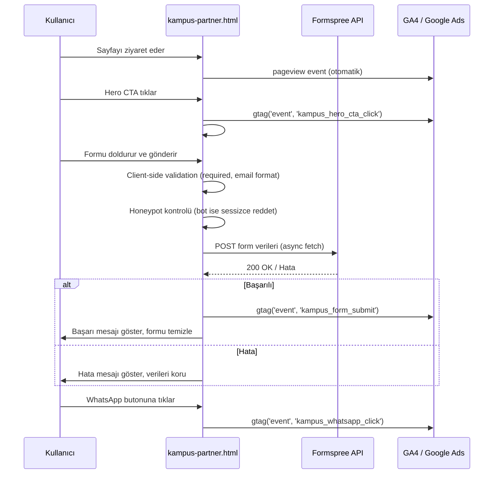

# Teknik Tasarım Dokümanı — Gelka Kampüs Partner

## Genel Bakış

### Amaç ve Kapsam

Bu doküman, `kampus-partner.html` landing page'inin teknik tasarımını tanımlar. Sayfa, mevcut gelkaenerji.com.tr statik sitesine entegre edilecek, tek dosyalık bir HTML sayfasıdır. Mevcut `styles.css` dosyasına eklenen CSS kuralları ve `script.js` ile uyumlu inline JavaScript ile çalışacaktır.

Sayfa, üniversite öğrencilerinin ticari işletmelerin elektrik faturalarını Gelka Enerji'ye ileterek aylık burs kazanmalarını sağlayan Kampüs Partner programını tanıtır ve başvuru toplar.

Kapsam dahilinde olan öğeler:
- Tek sayfalık statik HTML landing page (`kampus-partner.html`)
- Mevcut `styles.css` dosyasına eklenecek CSS kuralları
- Inline JavaScript davranışları (form gönderimi, accordion, sticky CTA, smooth scroll)
- Formspree entegrasyonu (form gönderimi)
- GA4 + Google Ads analitik entegrasyonu
- SEO meta etiketleri ve yapılandırılmış veri
- Responsive tasarım (320px–1920px)
- Temel erişilebilirlik uyumu

Kapsam dışında olan öğeler:
- Backend/sunucu tarafı geliştirme
- CMS entegrasyonu
- Kullanıcı kimlik doğrulama
- Ödeme/burs dağıtım sistemi
- A/B test altyapısı (Faz 2'de değerlendirilecek)

### Temel Tasarım Kararları

| Karar | Seçim | Gerekçe |
|-------|-------|---------|
| Sayfa mimarisi | Tek statik HTML dosyası | Mevcut site yapısıyla uyum; build tool yok |
| CSS stratejisi | `styles.css`'e yeni kurallar ekleme | Mevcut CSS değişkenleri ve bileşen stilleri yeniden kullanılır |
| JavaScript | Inline `<script>` + `script.js` referansı | Mevcut accordion, mobile menu, cookie, WhatsApp JS'i script.js'den gelir |
| Form gönderimi | Formspree (`https://formspree.io/f/xwvneaod`) | Mevcut sitedeki tüm formlarla aynı endpoint; sunucu tarafı kod gerektirmez |
| Analitik | gtag.js (GA4 + Google Ads) | Mevcut sitedeki tracking yapısının aynısı |
| Hero stili | Gradient arka plan (bayilik.html paterni) | Arka plan görseli gerektirmez, hızlı yüklenir |
| Accordion | Semantic `<button>` + `aria-expanded` | Erişilebilirlik uyumlu, mevcut FAQ paterni temel alınır |
| Spam koruması | Honeypot alanı (CSS ile gizli) | Basit bot koruması; CAPTCHA gerektirmez |
| Responsive yaklaşım | Mobile-first, breakpoint'ler: 768px, 1024px | Mevcut site ile tutarlı |

## Mimari

### Yüksek Seviyeli Mimari

Sayfa tamamen statik bir yapıdadır. Sunucu tarafı işlem yoktur. Tüm etkileşimler istemci tarafında gerçekleşir:

```
┌─────────────────────────────────────────────────────┐
│                    Tarayıcı                          │
│  ┌───────────────────────────────────────────────┐  │
│  │  kampus-partner.html (Statik HTML)            │  │
│  │  ├── styles.css (Paylaşılan CSS)              │  │
│  │  ├── script.js (Paylaşılan JS — menu, cookie) │  │
│  │  └── Inline <script> (Form, Accordion, CTA)   │  │
│  └───────────────────────────────────────────────┘  │
│           │              │              │            │
│           ▼              ▼              ▼            │
│    ┌──────────┐  ┌──────────────┐  ┌──────────┐    │
│    │ Formspree│  │ GA4/Google   │  │ WhatsApp │    │
│    │ API      │  │ Ads (gtag)   │  │ API      │    │
│    └──────────┘  └──────────────┘  └──────────┘    │
└─────────────────────────────────────────────────────┘
```

Teknoloji yığını:
- **HTML5**: Semantik etiketler, ARIA attribute'ları
- **CSS3**: CSS değişkenleri, Grid, Flexbox, media queries
- **Vanilla JavaScript**: ES6+, async/await, IntersectionObserver, FormData API
- **Formspree**: Form verilerini e-posta olarak ileten üçüncü parti servis
- **gtag.js**: Google Analytics 4 ve Google Ads izleme

### Dosya ve Kaynak Yapısı

```
gelkaenerji.com.tr/
├── kampus-partner.html          ← Yeni sayfa (tek dosya)
├── styles.css                   ← Mevcut — yeni CSS kuralları eklenir
├── script.js                    ← Mevcut — değişiklik yok
├── kvkk.html                    ← Mevcut — KVKK bağlantısı hedefi
├── sitemap.xml                  ← Güncellenir (yeni URL eklenir)
├── yatay_logo.png               ← Mevcut — OG image
├── index.html                   ← Mevcut — header/footer kaynak
└── bayilik.html                 ← Mevcut — hero/form paterni kaynak
```

### Sayfa Yapısı (DOM Hiyerarşisi)

```
kampus-partner.html
├── <head>
│   ├── Meta etiketleri (SEO, OG, canonical, robots)
│   ├── GA4 + Google Ads gtag.js
│   ├── styles.css referansı
│   ├── Google Fonts (Poppins)
│   ├── Font Awesome 6.4.0
│   └── Schema.org JSON-LD (WebPage)
├── <body>
│   ├── .top-banner (kopyala — index.html)
│   ├── .header (kopyala — index.html)
│   ├── #hero — .kampus-hero
│   ├── #guven — .trust-band
│   ├── #program-nedir — Program Tanıtımı
│   ├── #nasil-calisir — Nasıl Çalışır (4 adım timeline)
│   ├── #burs-modeli — Burs Tablosu
│   ├── #coklu-isletme — Birden Fazla İşletme
│   ├── #kariyer — Kariyer & Sektör Deneyimi (3 kart + banner)
│   ├── #kimler-katilabilir — Katılım Koşulları
│   ├── #sss — SSS Accordion (5 soru)
│   ├── #kampus-lideri — Kampüs Lideri
│   ├── #basvuru-formu — Başvuru Formu
│   ├── .footer (kopyala — index.html)
│   ├── .cookie-banner (kopyala — index.html)
│   ├── .whatsapp-float (özel mesaj metni)
│   ├── #stickyCta — Mobil Sticky CTA
│   └── <script> blokları
```

### Bilgi Mimarisi ve Bölüm Sırası

Bölüm sıralaması AIDA (Attention → Interest → Desire → Action) modeline dayanır:

| Sıra | Bölüm | AIDA Aşaması | Amacı |
|------|-------|--------------|-------|
| 1 | Hero | Attention | İlk izlenim, değer önerisi |
| 2 | Güven Şeridi | Attention | Kurumsal güvence |
| 3 | Program Nedir? | Interest | Modelin açıklanması |
| 4 | Nasıl Çalışır? | Interest | Sürecin netleştirilmesi |
| 5 | Burs Modeli | Desire | Somut kazanç örnekleri |
| 6 | Çoklu İşletme | Desire | Potansiyelin artırılması |
| 7 | Kariyer & Sektör | Desire | Burs ötesi değer |
| 8 | Kimler Katılabilir? | Desire | Hedef kitle eşleşmesi |
| 9 | SSS | Desire | Tereddütlerin giderilmesi |
| 10 | Kampüs Lideri | Desire | Ek motivasyon |
| 11 | Başvuru Formu | Action | Dönüşüm noktası |

### Veri Akışı



